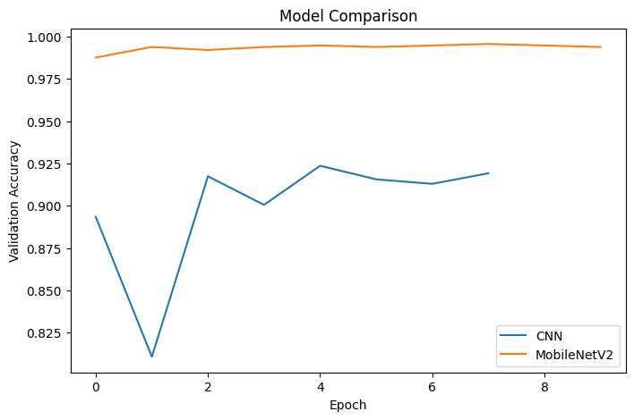

# Satellite Image Classification

This project classifies satellite images into four categories:
- cloudy
- desert
- green_area
- water

Two models are implemented and compared:
1. Custom CNN (built from scratch)
2. MobileNetV2 (transfer learning)

---

## Dataset

The dataset used in this project is from Kaggle:

https://www.kaggle.com/datasets/mahmoudreda55/satellite-image-classification

- Total images: 5631
- Classes: 4

The dataset is not included in this repository.

---

## Methodology

### Custom CNN
- Built using Conv2D and MaxPooling layers
- Includes Dropout to reduce overfitting
- Trained from scratch

### MobileNetV2
- Pretrained on ImageNet
- Frozen base model
- Custom classification head added

---

## Results

## Model Comparison

| Model | Validation Accuracy |
|------|---------------------|
| Custom CNN | 94.49%   |
| MobileNetV2 | 99.64% |

- MobileNetV2 achieved **99.64% validation accuracy**
- Custom CNN achieved **94.49% validation accuracy**
- Transfer learning improved performance by approximately **5%**

---

## Comparison

The custom CNN model was able to learn meaningful features from scratch and achieved strong performance.

However, MobileNetV2 significantly outperformed the CNN due to:

- Pretrained weights from ImageNet
- Better feature extraction capability
- Faster convergence during training
- More stable validation accuracy across epochs

---

## Key Learnings

- Understanding CNN architecture and feature extraction
- Importance of data preprocessing and augmentation
- Transfer learning improves performance significantly
- Model comparison helps evaluate effectiveness

---

## Future Work

- Fine-tuning MobileNetV2
- Testing on unseen real-world images
- Deploying as a web application

---

## Requirements

See `requirements.txt`
